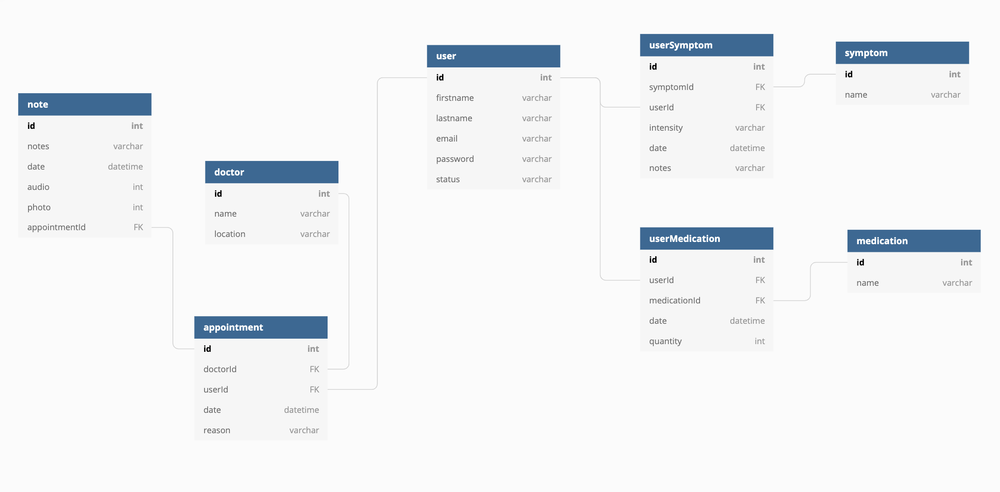

# CheckUp

CheckUp is a mobile application that eases communication between doctor and patient by allowing patients to organize questions pre doctor’s appointment, record appointments, track symptoms and store image files.

## Testing Locally

To run CheckUp locally: 
1. Clone this repository
1. To install all libraries and their dependencies, run npm install
1. Set up Auth0 (see below)
1. In the /api directory, run json-server -p 5002 database.json
1. Run npm start in root directory to start react server

## Set Up Auth0
1. Sign up or log in to Auth0 - https://auth0.com/
1. Once in your account, click the "Create Application" button
1. Choose "Single Page Web Application", then choose "React"
1. Inside your Application, click on "Settings"
1. Add http://localhost:3000/callback to the "Allowed Callback URLs"
1. You will need to copy the "Domain" and "Client ID" and place these into the Auth0Variables.js.example file
1. Rename the file to Auth0Variables.js

<!-- ## User Walkthrough -->
## Technology Used

ReactJS  
BootStrap  
ReactStrap  
Firebase  
Auth0  

## Entity Relationship Diagram

## Contributors
Asia Carter

