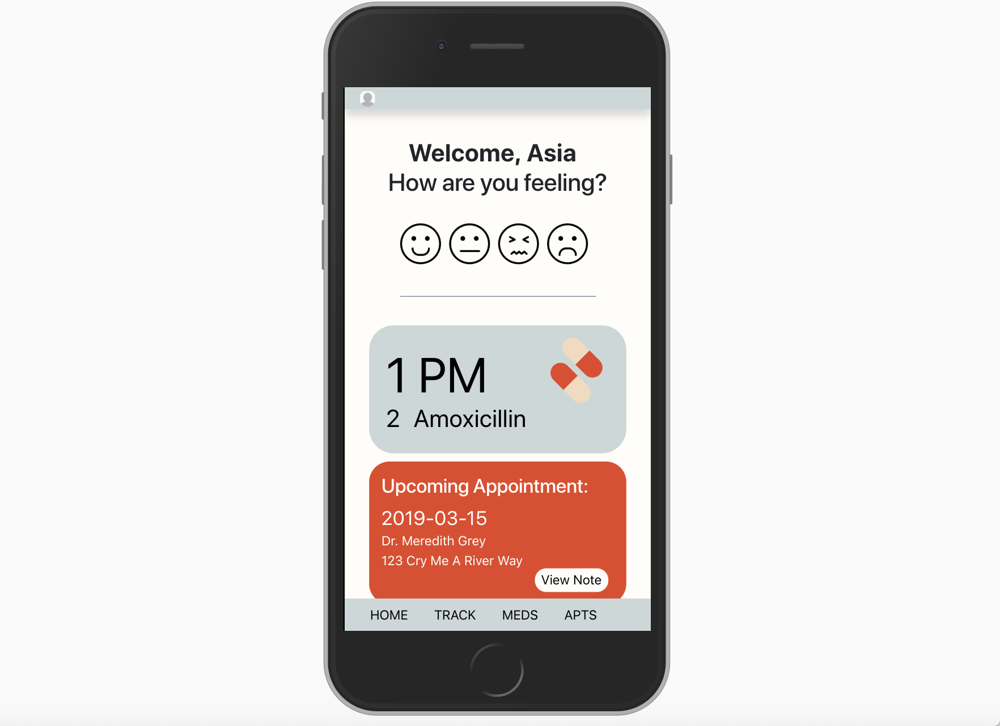

# CheckUp

CheckUp is a mobile application that eases communication between doctor and patient by allowing patients to organize questions pre and post doctor’s appointment, record appointments, track symptoms and store files.

## Installation

1. Clone repository
1. Cd src
1. Npm install
1. From root directory cd public
1. Run json server on port 5002
1. Open localhost: 3000 in the browser of your choice
1. Register for an account and explore the application at your leisure

## Tech Used

ReactJS
BootStrap
ReactStrap
Firebase

## Contributors
Asia Carter
